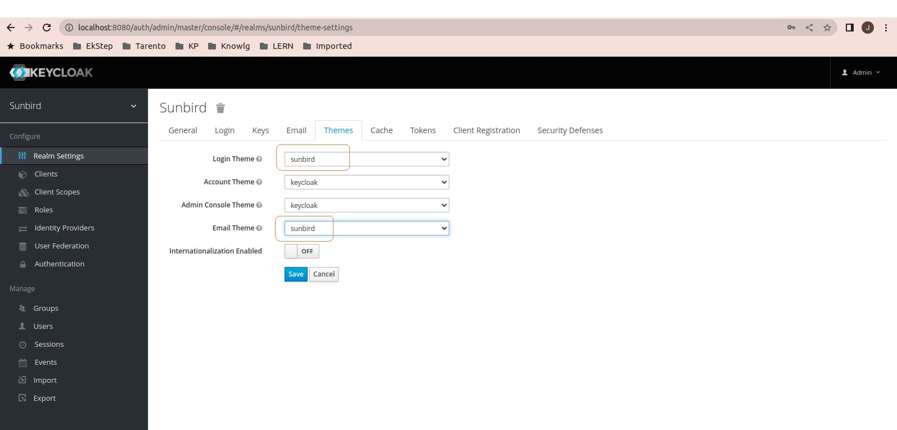

# Local setup of keycloak for Sunbird

This readme file provides instructions for setting up keycloak for sunbird in a local machine.

### System Requirements

### Prerequisites

- Java 11
- Latest Docker

### Steps for local setup

To set up the keyloak for sunbird in local, follow the steps below:

1. Clone the latest branch of the user-org service using the following command:
```shell
git clone https://github.com/Sunbird-Lern/sunbird-lms-service.git
```

2. Execute the shell script present in the path `<project-base-path>/sunbird-lms-service/keycloak-local-setup/keycloak_v701`:
```shell
sh keycloak_docker.sh
```
Note: Modify 'keycloak_docker.sh' file using a text editor to prepend 'sudo ' to all docker commands if you don't have root user permissions. Example: 
```
sudo docker network create keycloak-postgres-network
```

3. Wait for the script to complete execution and make sure the keycloak container and postgres container creation is successful before proceeding to the next step using the below command: 
```shell
docker ps -a
```
Note: Prepend 'sudo ' to above command if you don't have root user permissions.

Verify docker containers exists with names 'kc_local' and 'kc_postgres' and are running.

4. Login to postgres docker container bastion using following command:
```shell
docker exec -it kc_postgres sh
```

5. Connect to postgres database using below command:
```shell
psql postgresql://kcpgadmin:kcpgpassword@kc_postgres:5432/quartz
```

6. Execute below command to create table in postgres database:
```shell
CREATE TABLE IF NOT EXISTS JGROUPSPING (own_addr varchar(200) NOT NULL, cluster_name varchar(200) NOT NULL, ping_data BYTEA, PRIMARY KEY (own_addr, cluster_name));
```

7. To verify if keycloak for sunbird is configured,
   - login to keycloak ( http://localhost:8080/auth - use keycloak credentials mentioned in 'keycloak_docker.sh').
   - Check if 'Sunbird' realm is selected.
   
   - Check if 'sunbird' is available as an option under 'Themes' realm sub-menu for 'Login Theme' and 'Email Theme'.
   
   - Check if 'cassandra-storage-provider' is present under 'User Federation' configuration menu. This is the value to be saved for 'sunbird_keycloak_user_federation_provider_id' config variable while integration with user-org service. (sunbird_keycloak_user_federation_provider_id = cassandra-storage-provider)
   
   - Check if clients (portal, lms, android, etc.) are available
   

8. Open 'LMS' client from 'Clients' Menu. Go to 'Service Account Roles' tab  and add 'admin' role in 'Realm Roles' as shown
   

9. In 'Client Roles' drop down of 'LMS' client, select 'realm-management' and add 'manage-users' role as shown
   

10. In 'Settings' tab of 'LMS' client, enable 'Direct Access Grants Enabled'


12. In 'Credentials' tab of 'LMS' client, click on 'Regenerate Secret' button with 'Client Authenticator' as 'Client Id and Secret'. This is the value to be saved for 'sunbird_sso_client_secret' config variable while integration with user-org service. (sunbird_sso_client_id = lms, sunbird_sso_client_secret = newly generated secret)

13. Local LMS setup keycloak related configurations will be as follows:
```shell
sunbird_keycloak_user_federation_provider_id = cassandra-storage-provider
sunbird_sso_username = admin
sunbird_sso_password = sunbird
sunbird_sso_url = http://localhost:8080/auth/
sunbird_sso_realm = sunbird
sunbird_sso_client_id = lms
sunbird_sso_client_secret = newly generated secret of 'lms' client
```


### Shell script docker commands description

Shell script contains docker commands to create postgres v11.2 database container and keycloak v7.0.1 container. It also has commands to copy sunbird keycloak artifacts viz SPI provider jar, themes, postgres driver module, realm and configuration changes to keycloak.

- "-p 32769:5432" maps the host's port 32769 to the container's port 5432, allowing access to the postgres database.
- "-p 8080:8080" maps the host's port 8080 to the container's port 8080, allowing access to the keycloak application. Update the host's port to unused port number if the '8080' port is already used by another application.
- "--name <container_name>" assigns a name to the container, which can be used to reference it in other Docker commands.
- "-v $sunbird_dbs_path/keycloak/realm:/opt/jboss/keycloak/imports" mounts the host's directory "$sunbird_dbs_path/keycloak/realm" containing sunbird realm to container's "/opt/jboss/keycloak/imports"
- "-v $sunbird_dbs_path/keycloak/spi:/opt/jboss/keycloak/providers" mounts the host's directory "$sunbird_dbs_path/keycloak/spi" containing sunbird-auth keycloak SPI jar to container's "/opt/jboss/keycloak/providers"
- "-v $sunbird_dbs_path/keycloak/modules:/opt/jboss/keycloak/modules/system/layers/keycloak/org/postgresql/main" mounts the host's directory "$sunbird_dbs_path/keycloak/modules" containing postgres driver module to container's "/opt/jboss/keycloak/modules/system/layers/keycloak/org/postgresql/main"
- "-e KEYCLOAK_IMPORT="/opt/jboss/keycloak/imports/sunbird-realm.json -Dkeycloak.profile.feature.upload_scripts=enabled"" sets an environment variables necessary for keycloak to import sunbird realm.
- "--net <network_name>" assigns the container to a Docker network, which is used to connect the container to other containers in the same network.
- "-d" runs the container in detached mode, which allows it to run in the background.


### Latest sunbird keycloak artifacts repositories

- Themes: https://github.com/project-sunbird/sunbird-devops/tree/release-5.2.0/ansible/artifacts/sunbird
- Module xml: https://github.com/project-sunbird/sunbird-devops/blob/release-5.2.0/ansible/roles/keycloak-deploy/templates/module.xml.j2
- Standalone-ha.xml Configuration file: https://github.com/project-sunbird/sunbird-devops/blob/release-5.2.0/ansible/roles/keycloak-deploy/templates/standalone-ha.xml
- SPI Provider: https://github.com/Sunbird-Lern/sunbird-auth/tree/release-3.8.0/keycloak/sms-provider
- Realm: https://github.com/project-sunbird/sunbird-devops/blob/release-5.2.0/ansible/roles/keycloak-deploy/templates/keycloak-realm.j2


### Understanding keycloak on Sunbird
Please refer to https://project-sunbird.atlassian.net/l/cp/St3y353z for understanding keycloak on sunbird and user authentication flows.